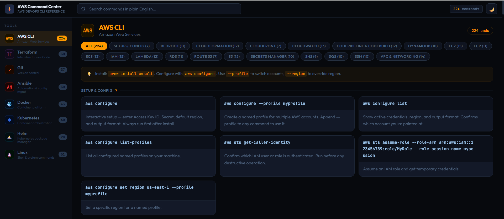
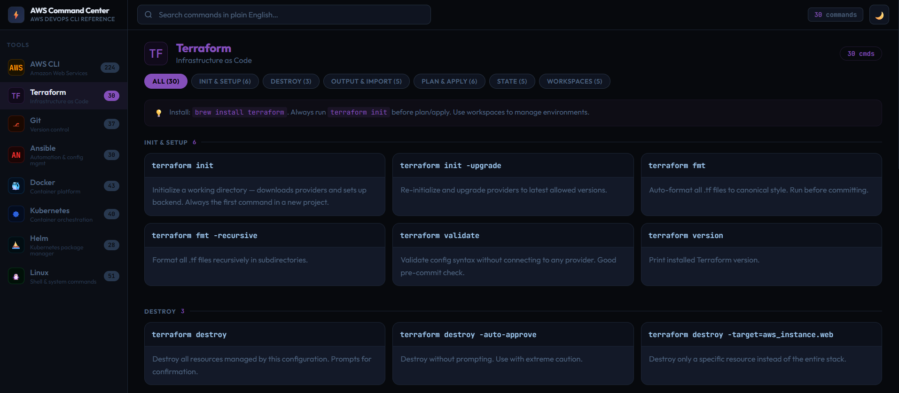
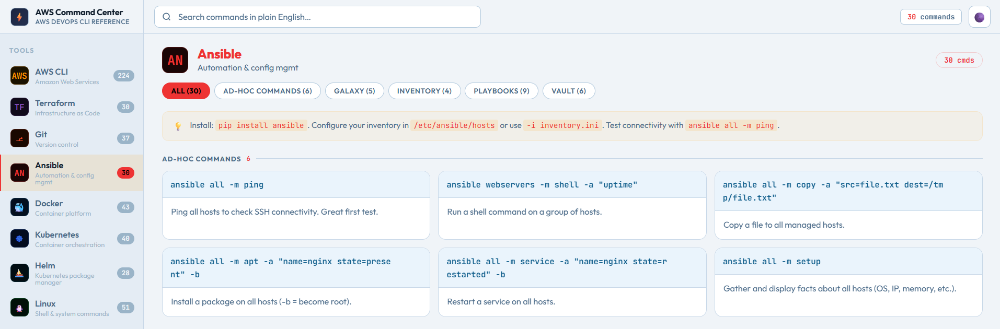
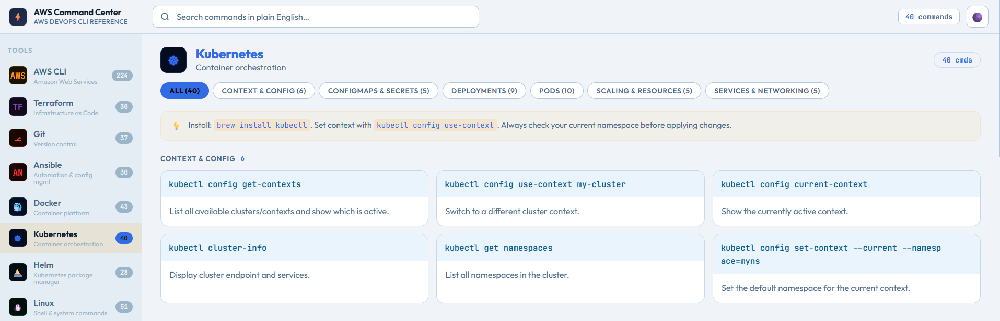
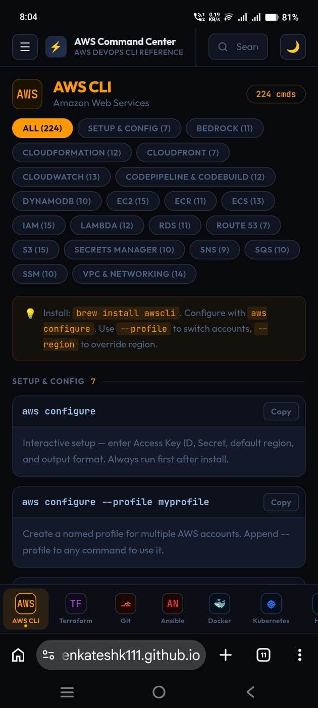
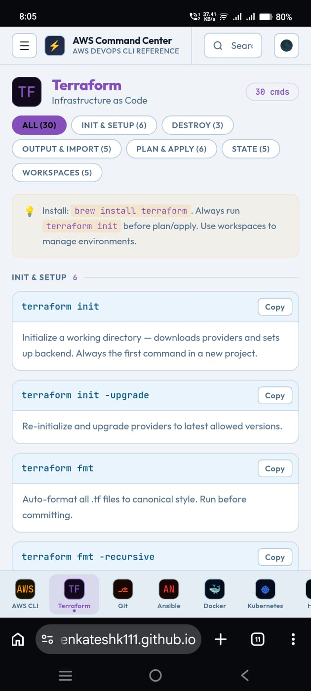

# ⚡ AWS DevOps Command Center

> A fast, searchable command reference built for AWS & DevOps engineers.  
> No login. No install. No fluff. Just commands.

🔗 **Live site:** [venkateshk111.github.io/aws-devops-command-center](https://venkateshk111.github.io/aws-devops-command-center)


---

## 🛠 Tools Covered

| Tool | Commands | Areas Covered |
|------|----------|---------------|
| ☁️ **AWS CLI** | 254 | S3, EC2, RDS, IAM, Lambda, CloudFormation, CloudWatch and Others|
| 🟣 **Terraform** | 30 | Init, Plan, Apply, State, Workspaces, Import |
| ⎇ **Git** | 37 | Branching, Remote, Stash, Rebase, Reset |
| 🔴 **Ansible** | 30 | Inventory, Playbooks, Vault, Galaxy |
| 🐳 **Docker** | 43 | Images, Containers, Volumes, Networks, Compose |
| ☸ **Kubernetes** | 40 | Pods, Deployments, Services, Scaling, ConfigMaps |
| ⛵ **Helm** | 28 | Repos, Install, Upgrade, Rollback, Chart Dev |
| 🐧 **Linux** | 51 | Files, Processes, Network, Permissions, Archives |
| 🦞 **OpenClaw** | 154 | OpenClawAI agent platform CLI |

**600+ commands total** - all with plain-English descriptions and one-click copy.

---
## Screenshots

### Website

<table>
<tr>
<td></td>
<td></td>
</tr>
<tr>
<td></td>
<td></td>
</tr>
</table>

### Mobile

<table>
<tr>
<td></td>
<td></td>
</tr>
</table>


## ✨ Features

- 🔍 **Smart search** - type plain English (`list ec2 instances`, `deploy lambda`, `check logs`)
- 📋 **One-click copy** - hover any command card and hit Copy
- 🌙 **Dark / Light theme** - toggle in the top-right corner
- 📱 **Mobile friendly** - scrollable bottom tab bar + slide-in drawer on phones
- ⚡ **Zero dependencies** - single HTML file, no npm, no build step, works offline
- 🔒 **Privacy first** - no tracking, no analytics, no data collected

---

## 🔍 Search Examples

You don't need to know the exact command, just describe what you want:

| You type | What you find |
|----------|---------------|
| `list ec2` | All EC2 describe/list commands |
| `deploy lambda` | Lambda update, invoke, publish |
| `check logs` | CloudWatch tail, docker logs, journalctl |
| `rollback kubernetes` | kubectl rollout undo |
| `delete s3 bucket` | aws s3 rb, rm --recursive |
| `create iam user` | aws iam create-user, attach-policy |
| `scale pods` | kubectl scale, autoscale HPA |
| `ssh into server` | EC2 connect, ssh commands |

---

## 🚀 Local Development

No build tools needed. Just open the file in a browser:

```bash
git clone https://github.com/venkateshk111/aws-devops-command-center.git
cd aws-devops-command-center
open index.html   # macOS
# or just drag index.html into any browser
```

<!-- ---

## 🗺 Roadmap

- [ ] Keyboard shortcut to focus search (`/`)
- [ ] Bookmark / favourite commands
- [ ] Beginner / Advanced command tags
- [ ] More AWS services - EKS, ECS Fargate, CDK, Step Functions, Secrets Manager
- [ ] More tools - HashiCorp Vault, ArgoCD, Prometheus, GitHub Actions CLI

--- -->

---

## 📄 License

MIT - free to use, fork, and adapt. A link back is appreciated.

---

## ☕ Support

If this saved you some time, consider sponsoring to keep it updated and growing!

[](https://github.com/sponsors/venkateshk111)
